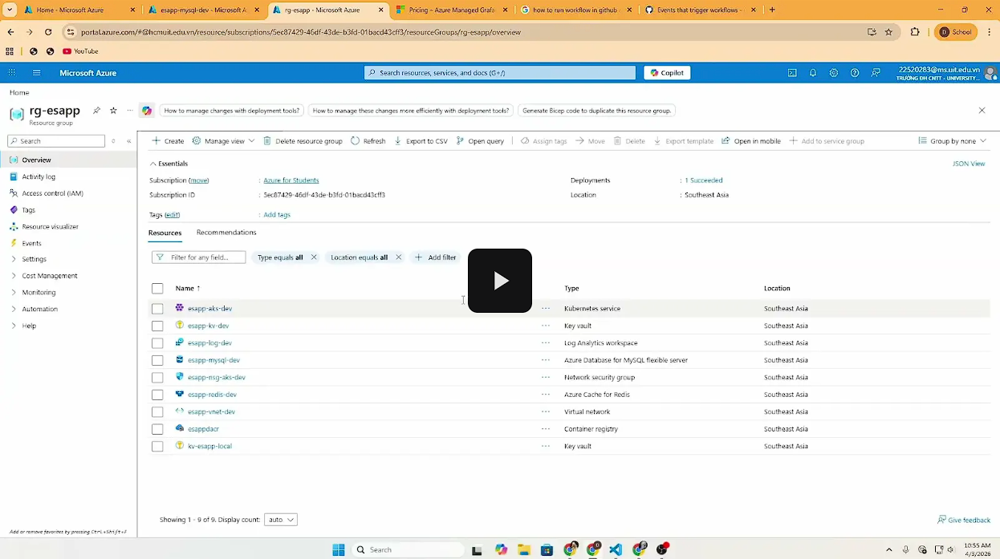
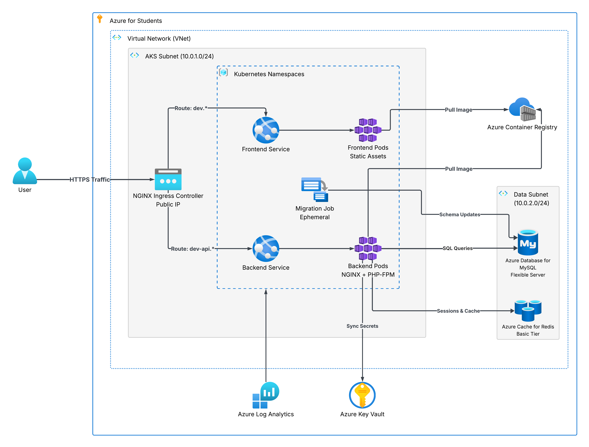
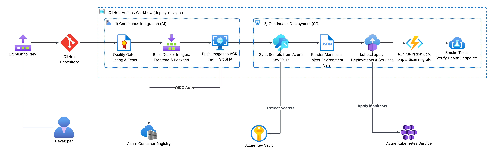
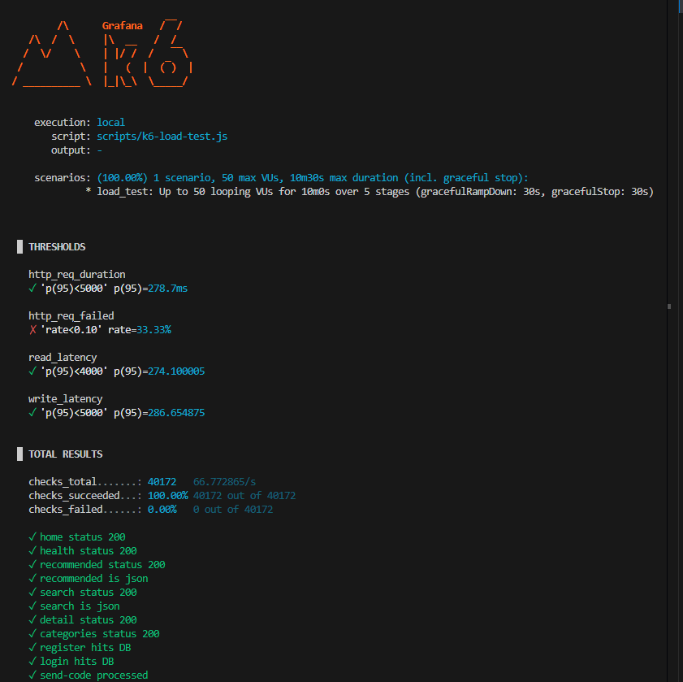

# ESApp - Cloud-Native Electronic E-Commerce Platform


## 📖 Overview
ESApp is a modern, highly scalable Electronic E-Commerce platform built using a microservices-inspired architecture. Designed to handle high-traffic workloads, the project leverages a **Cloud-Native (CNCF)** approach on **Microsoft Azure**, integrating container orchestration, managed databases, automated CI/CD pipelines, and serverless computing.

The system is split into:
- **Frontend:** React (Vite) Single Page Application (SPA).
- **Backend:** Laravel API.
- **Infrastructure:** Fully provisioned using **Terraform** on Azure (AKS, MySQL Flexible Server, Redis Cache).
- **Serverless:** Azure Functions used as a side-car for out-of-band background processing (e.g., parallel email delivery).

---

## 🎥 Demo Video

[](https://drive.google.com/file/d/1UGKC78UHIDc8RhGz5UgUc0hbyAWz4y1H/view?usp=drive_link)

---

## 🛒 Web Application Features

The core application consists of a **React (Vite) Single Page Application** interacting with a **Laravel REST API**.

### For Customers:
- **Authentication & Security:** Secure JWT-based login, Google OAuth integration, and email verification workflows.
- **Product Discovery:** Browse products dynamically across categories (Computing, Mobile, TV & AV) with detailed product pages.
- **Shopping Cart & Checkout:** Seamless cart management, promotional code application, and secure order placement.
- **User Dashboard:** Dedicated profile management where users can track active/past orders, view order details, and manage loyalty rewards (`My Rewards`).

### For Administrators:
- **Admin Dashboard:** A centralized portal for managing inventory, tracking overall sales, updating order statuses, and managing customer accounts.

---

## 🏗️ Architecture



### Core Components & Azure Services
| Service Name | Model | Role in Project |
|--------------|-------|-----------------|
| **Azure Kubernetes Service (AKS)** | CaaS / PaaS | Orchestrates backend and frontend application containers. |
| **Azure Container Registry (ACR)** | PaaS | Stores and manages Docker container images for deployment. |
| **Azure MySQL Flexible Server** | PaaS | Managed relational database for persistent application data. |
| **Azure Cache for Redis** | PaaS | In-memory data store for caching and session management. |
| **Azure Key Vault** | PaaS | Securely stores sensitive secrets (DB passwords, API keys). |
| **Azure Functions** | FaaS / Serverless | Handles event-driven background tasks (e.g., parallel verification emails). |

---

## 🛠️ Technology Stack

- **Frontend:** React, Vite, TailwindCSS
- **Backend:** PHP 8, Laravel 11, Nginx
- **Database / Cache:** MySQL 8, Redis
- **Infrastructure as Code (IaC):** Terraform
- **Containerization:** Docker, Kubernetes (K8s manifests)
- **CI/CD:** GitHub Actions (with OIDC authentication to Azure)
- **Load Testing:** Grafana k6

---

## ✨ Key Features

1. **Blue/Green Deployment Ready:** Kubernetes manifests are structured to support zero-downtime updates.
2. **Serverless Parallel Email Processing (FaaS):**
   - **Decoupling:** Verification emails are sent via an HTTP-triggered **Azure Function** concurrently with the main backend process.
   - **Auto-scale:** The Function App (Consumption Plan) scales out automatically based on incoming traffic without impacting the main AKS nodes.
   - **Cost Optimization:** Serverless pay-per-execution model ensures we only pay when emails are actively being sent.
3. **Decoupled Database Migrations:** Database schema updates are handled by a dedicated Kubernetes `Job` during the CI/CD pipeline, avoiding race conditions during pod startup.
4. **Secure Secret Management:** Zero hardcoded credentials. All secrets are pulled dynamically from Azure Key Vault into Kubernetes `Secret` objects during deployment.

---

## 🚀 CI/CD Pipeline Workflow



Our GitHub Actions pipeline (`deploy-dev.yml`) automates the entire delivery process:
1. **Lint & Test:** Code formatting via Laravel Pint and unit testing.
2. **Build & Push:** Docker images are built and pushed to ACR.
3. **Migrate:** A dedicated K8s Job runs database migrations.
4. **Deploy manifests:** Updates ConfigMaps and Deployments in AKS.
5. **Deploy Serverless:** Zips and deploys the Node.js source code to the Azure Function App via `az functionapp deployment source config-zip`.

---

## 📊 Performance & Load Testing



We utilize **k6** to simulate high-concurrency environments and monitor Azure infrastructure limits. 
- **Read/Write Operations:** Load profiles distribute traffic between read-heavy GETs and write-heavy POSTs.
- **Optimization Strategy:** Database connection pooling, Redis caching, and decoupling email dispatch to FaaS were implemented to reduce the P95 latency footprint on the main AKS cluster under load.

---

## 💻 Local Development Setup

### Prerequisites
- Docker & Docker Compose
- Node.js (v20+) & npm
- PHP 8.2+ & Composer
- Terraform CLI (for infra provisioning)
- Azure CLI

### 1. Run Application Locally
```bash
# Clone repository
git clone https://github.com/your-username/esapp.git
cd esapp

# Start Laravel backend
cd is-web-project
composer install
cp .env.example .env
php artisan key:generate
php artisan serve

# Start React frontend
cd ../electronic-e-commerce
npm install
npm run dev
```

### 2. Provision Azure Infrastructure (Terraform)
```bash
cd terraform

# Fill in your environment variables
cp terraform.tfvars.example terraform.tfvars

# Initialize and Apply
terraform init
terraform plan
terraform apply
```

---

## 📝 License
This project is for academic purposes. 
